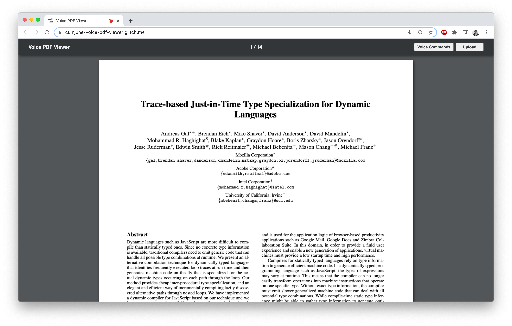

# Voice PDF Viewer


## Description

This repo is the week2 assignment of the "Hello, Computer" course at ITP.
The assignment was to create something that takes voice input from a person and responds without text.

I decided to create a voice-controlled PDF viewer app.

Here's the [Live Demo on Glitch](https://cuinjune-voice-pdf-viewer.glitch.me/). (Works in Chrome browser only)

## How it works

The app seems to only works in Chrome browser because of `webkitSpeechRecognition`. The app will start with a sample PDF file being opened. The user can load their own PDF file by clicking on the "Upload" button at the top right corner.
The app works just like other existing PDF viewers except that it responds to voice commands.

Here's the list of all voice commands that are supported: (The user can see the list within the app by clicking on the "Voice Commands" button) 
- "SCROLL UP": scroll up
- "SCROLL DOWN": scroll down
- "SCROLL TOP": scroll to the top of the page
- "SCROLL MIDDLE": scroll to the middle of the page
- "SCROLL BOTTOM": scroll to the bottom of the page
- "SCROLL PREVIOUS": scroll to the previous page
- "SCROLL NEXT": scroll to the next page
- "SCROLL FIRST": scroll to the first page
- "SCROLL LAST": scroll to the last page

**Actually, the app should respond to your commands without saying "SCROLL" but I just added them since the app seemed to recognize the follow up words better when it's prefixed with "SCROLL".**

The user is expected to mostly use "SCROLL UP" and "SCROLL DOWN" commands that are enough to allow the user to read through the document page by page. But it also offers more specific commands such as "SCROLL TOP" which can be useful when the user is reading a page written in multiple columns of text.
The scrolling always works by dividing a page in 3 sections that are top, middle, bottom because it is easier for the user to keep track of the page while requiring minimal scrolling commands.

## Process & Thoughts

For the PDF viewer, I reused the code I've written for the [Simple PDF Annotator](https://github.com/cuinjune/simple-pdf-annotator) app which I created this semester. 
It uses the [PDF.js](https://github.com/mozilla/pdf.js/) library supported by Mozilla. So for this app, I basically added the scrolling part that responds to the user's voice commands.
The scrolling works by calling `window.scrollTo()` function, and it was a bit difficult to calculate the target scrolling position so a page can be scrolled in 3 sections. (top, middle, bottom)
But I find this way much more intuitive and efficient than scrolling the page up or down by arbitrary offset since the user can always keep track of exactly what part of the page is currently being displayed.
It could also have been divided into 2 sections - top and bottom, but I was worried that some pages with longer height might not be covered by the 2 sections. 
But I think it's something I might consider updating in the future since it will reduce the number of commands and provide better user experience.

The goal of this app was mainly to explore simple UI interaction using voice commands but I think this app could actually be useful in some cases such as the following examples:

- A piano player who practices along a note sheet can find the app useful just like the person who posted [this](https://www.tenforums.com/software-apps/96323-pdf-viewer-voice-control.html).
- A person who is cooking while following a recipe on a PDF document might find the app useful.
- A person who wants to read a PDF document while sitting/lying on a sofa or bed might find the app useful in some postures.
- Disabled people and people who had their arms/hands injured might find the app useful.

## Setup

1. You need to have [Python](https://realpython.com/installing-python/) installed on your computer
2. Run the following commands in the Terminal
```
git clone https://github.com/cuinjune/voice-pdf-viewer.git
cd voice-pdf-viewer
python -m http.server 8080
```
3. Open your web browser and navigate to http://localhost:8080

## Author
* [Zack Lee](https://www.cuinjune.com/about): an MPS Candidate at [NYU ITP](https://itp.nyu.edu).
